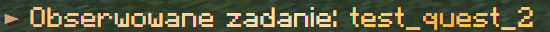

### General

```
<#7c5058>► <gradient:#c95e7b:#ed7d95:#ed7d95:#b55e7b>Aby odebrac nagrode dzienna, uzyj</gradient> <#f4a9ba>LPM<gradient:#c95e7b:#ed7d95:#ed7d95:#b55e7b>.</gradient>
```

#### Components

- leading character: `<#7c5058>`
- text: `<gradient:#c95e7b:#ed7d95:#ed7d95:#b55e7b>`
- value: `<#f4a9ba>`

#### Preview

</img>

### Informational

```
<#d3a37e>► <gradient:#f5c894:#f6d4a2:#f9e2b4:#f6d4a2:#f5c894>Ukoncz wszystkie cele, aby zakonczyc to zadanie.</gradient>```
```

#### Components

- leading character: `<#d3a37e>`
- text: `<gradient:#f5c894:#f6d4a2:#f9e2b4:#f6d4a2:#f5c894>`
- value: `<gradient:#f7cf78:#fbd06a:#f4b352:#fbd06a:#f7cf78>`

#### Preview

</img>

### Exceptional

```
<#990000>► <gradient:#b51c1c:#d33131:#c72929:#d33131:#b51c1c>Musisz odczekac jeszcze <gradient:#ffad33:#ff8052:#ffdb57:#ff8052:#ffdb57:#ffad33>15 minut i 30 sekund<gradient:#b51c1c:#d33131:#c72929:#d33131:#b51c1c>, zanim ponownie uzyjesz tej komendy.
```

#### Components

- leading character: `<#990000>`
- text: `<gradient:#b51c1c:#d33131:#c72929:#d33131:#b51c1c>`
- value: `<gradient:#ffad33:#ff8052:#ffdb57:#ff8052:#ffdb57:#ffad33>`

#### Preview

</img>